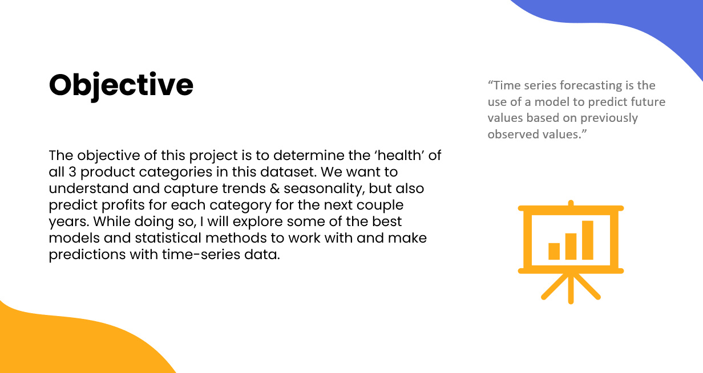
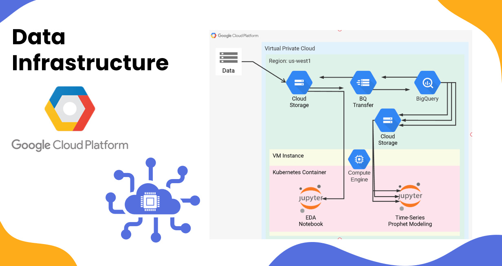

# Retail-Sales-EDA---profit-prediction

### The objective of this project is to determine the ‘health’ of all 3 product categories in this dataset. We want to understand and capture trends & seasonality, but also predict profits for each category for the next couple years. While doing so, I will explore some of the best models and statistical methods to work with and make predictions with time-series data.

